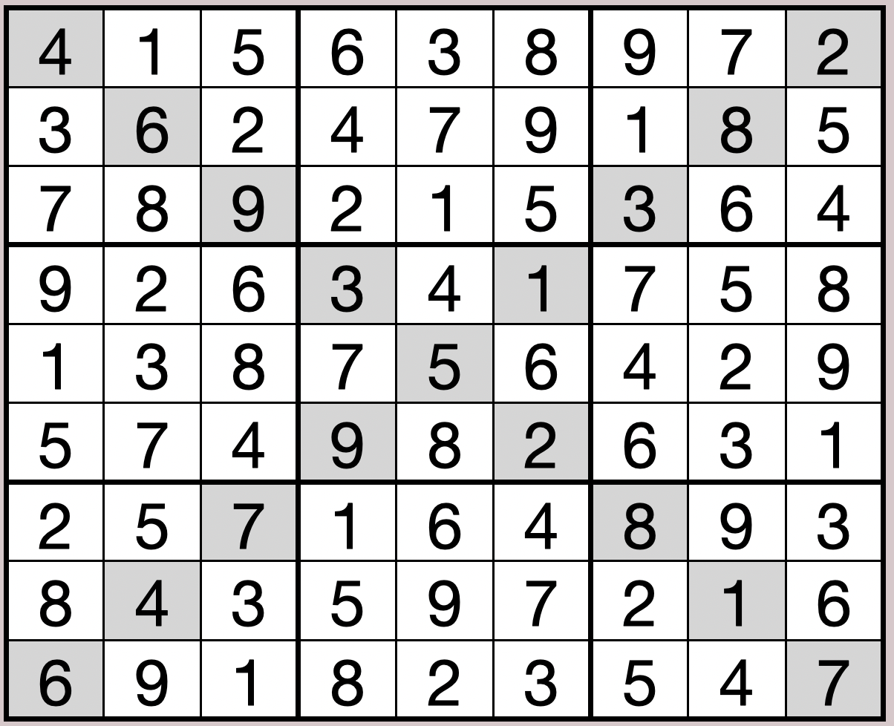
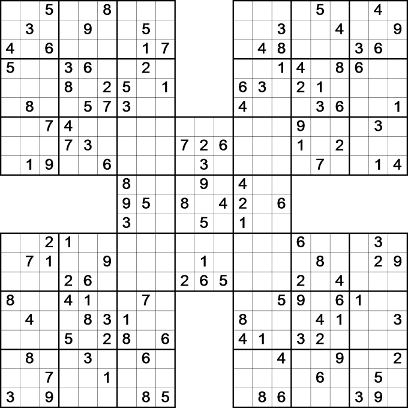

# CS50 Final Project Extra Credit

## Acknowledgements (Github username)
* Lizzie Hernandez (lizziehv)
* Maria Paula Mora (mpmora00)
* Ethan Trepka (et22)
* Kshitij Jain (jkshitij77)

## Sudoku Puzzle Creator/Solver Overview
Our extra credit has two parts, the first is creating other sudoku puzzles. For this we created several levels and types, like a diagonal sudoku and a samurai sudoku and then we updated our code to solve these puzzles. 

The second part is the graphics, where we showed each puzzle and allow a user to solve it. These will all be described below.

### Usage without graphics

#### Levels
As an extra credit, we didn't simply want to focus on graphics, instead we wanted to make a graphics interface with levels that challenged the player on different sudoku types. 

##### Usage
To expland upon`sudoku.c`, the extra-credit program works with the user through command lines:

For a normal sudoku:
``` bash
# creates a 9x9 grid with a unique solution 
# outputs the grid into the stdout
./sudoku create
./sudoku create easy

## can be solved in two ways
./sudoku solve
./sudoku solve easy 
```

For a medium sudoku:
``` bash
# creates a 9x9 grid with a unique solution 
# outputs the grid into the stdout
# This is a diagonal sudoku (meaning the diagonal lines "X" are also unique just like the horizontal and vertical)
./sudoku create medium

# can be solved both ways
./sudoku solve
./sudoku solve medium
```

For a hard sudoku:
``` bash
# creates a 9x9 grid with a unique solution 
# outputs the grid into the stdout
# This is a samurai sudoku (which means that there will be 5 overlapping sudokus)
./sudoku create hard

# if a hard sudoku is given but sudoku solve hard is not called then the solve will give incorrect format
./sudoku solve hard
```

##### Easy Level Description
This is the original sudoku level. It can be run with both of the following commands:
``` bash
./sudoku create
./sudoku create easy
```
This is explained more in depth in [README](../README.md).

##### Medium Level Description


Just like with the original, the documents `create.h` and `create.c` are called by `sudoku.c` when the following command line is asked to execute:
``` bash
./sudoku create medium
```

The medium puzzle has no different function calls than the original sudoku, the only difference is that in functions like the once shown below, the level given is 2 now. This causes the code to make sure that the diagonals are also unique. 
```c
// Builds a sudoku using random numbers
// where for the medium, the level is s
void sudoku_build(int sudoku[9][9], int level);

// Takes the sudoku and makes a puzzle by removing 40 numbers
// It deletes random numbers and makes sure that the sudoku has a unique solution
// where for the original, the level is 2
void create_puzzle(int sudoku[9][9], int level);
```

This will add an extra if statement that makes sure that the diagonals are unique thorughout the creation process.

##### Output
This function outputs in the exact same format as the original sudoku, but the solution should have unique diagonal numbers
```
0 0 0 0 7 6 0 0 4
4 0 0 3 2 8 0 0 9
3 0 1 9 4 0 0 0 7
1 0 0 8 0 7 0 4 0
0 0 6 4 0 3 0 7 0
5 4 7 2 1 0 0 8 0
7 5 0 0 8 0 4 9 2
0 0 2 7 0 0 0 3 0
0 8 0 0 0 2 7 1 6
```

When solved, since the sudoku should have a unique siolution, there won't be any different process than how the normal sudoku is originally solved. We still added a command line input for consistency but the process would remain the same.

##### Hard Level Description


This level is tested in [testing.sh](testing.sh) separately, to not distrupt the original sudoku. It tests all of the same things tested by the orignal sudoku, except for the fuzzgenerator. It can be run by cd into this directory and calling `make test`. 

###### Create
Just like with the original, the documents `create.h` and `create.c` are called by `sudoku.c` when the following command line is asked to execute:
``` bash
./sudoku create hard
```

This command line, calls the program `create.c` which will:
1. Create a 3D array where the first values is each individual sudoku and the second and third are the row and column
2. Build will also fill in the arrays, where the overlapping corners will be the same
2. For 40 iterations
    3. While there would be a unique solution (for all of the puzzles)
    4. Randomly choose one value to delete from the board 
    5. Check to see if this value has already been erased before
    6. Attempt to delete it
        8. If it would have a unique solution, then change the number to zero
        9. Else, put back the original number
10. Print the final puzzle to stdout
11. Exit with zero status

This puzzle done with two main functions:
```c
/*
 * Given an empty samurai sudoku, builds a sudoku using random numbers
 * (unique numbers in every row, column, box, an overlapping middle sudoku)
 */
void samurai_build(int sudoku[5][9][9]); 

/* 
 * Takes a completed sudoku and makes a puzzle by removing num_removed numbers
 * It deletes random numbers and makes sure that the sudoku has a unique solution
 */
void create_puzzle_samurai(int sudoku[5][9][9], int num_removed);
```

Output:
- It will print a randomized samurai sudoku with 40 empty spaces that need to be solved
    - Every time it is called, there will be a unique, random sudoku

For example: 
``` bash
7 6 8 4 0 9 5 2 0       6 0 8 1 9 2 3 5 4 
2 5 4 6 7 1 9 8 3       3 1 9 5 6 4 7 2 8 
0 9 1 8 2 5 7 6 4       2 4 5 7 3 8 1 6 0 
1 2 6 5 8 4 0 0 9       4 9 6 8 2 7 5 1 3 
9 3 0 2 1 7 6 4 8       5 0 1 9 4 6 8 0 2 
4 8 7 3 9 0 1 5 0       7 8 2 3 5 1 9 0 6 
5 4 9 1 6 0 2 3 7 0 8 0 8 6 0 4 1 5 2 9 7 
8 7 2 9 5 3 4 1 6 5 3 0 9 0 4 2 7 0 6 8 1 
6 1 3 7 4 2 8 9 0 2 0 7 1 2 7 6 8 9 4 3 5 
            3 0 9 4 2 6 5 8 1             
            2 6 1 8 7 5 9 4 3             
            4 5 8 9 1 3 6 7 2             
8 9 1 2 4 7 5 3 6 0 5 8 1 2 7 3 9 8 5 4 6 
3 6 7 5 9 1 8 4 2 7 9 2 6 9 4 1 7 5 2 8 3 
0 5 0 8 6 3 1 7 9 0 6 4 8 3 5 2 6 4 1 7 9 
6 2 9 7 8 5 3 1 4       7 8 6 4 1 9 0 2 5 
4 7 5 0 1 6 2 9 8       3 1 2 7 5 6 8 9 4 
1 3 8 9 2 4 6 5 0       5 4 9 8 3 2 7 6 1 
9 4 6 1 5 8 7 2 3       4 5 3 9 8 7 6 1 0 
5 8 3 4 7 2 9 6 1       9 0 1 0 2 3 4 0 8 
7 1 2 6 3 0 4 8 5       2 6 8 0 4 1 9 3 7 
```

###### Solve
Just like with the original, the sudoku is solved when the following command line is asked to execute:
``` bash
./sudoku solve hard
```

This command line, calls the program `solve()` in `solve.c` which will:
```
1. Take a parsed samurai sudoku matrix
2. Then it will loop through every sudoku and solve each of them individually (since they have a unqiue solution, the middle overlap shouldn't be an issue)
```

This is done with two main functions:
```c
// Complete a samurai, a set of 5 overlapping sudoku puzzles, each with a unique solution
bool solve_samurai(int samurai[5][9][9]);
```

##### Standard Input 
Samurai Sudoku solve prompts the user for a puzzle to solve which has certain specifications 
- No repeated numbers in every row
- No repeated numbers in every column
- No repeated numbers in every 3x3 squared region
- A 9x9 grid size 5 times (overlapping in the middle)

A correct input would look like the following:
``` 
7 6 8 4 0 9 5 2 0       6 0 8 1 9 2 3 5 4 
2 5 4 6 7 1 9 8 3       3 1 9 5 6 4 7 2 8 
0 9 1 8 2 5 7 6 4       2 4 5 7 3 8 1 6 0 
1 2 6 5 8 4 0 0 9       4 9 6 8 2 7 5 1 3 
9 3 0 2 1 7 6 4 8       5 0 1 9 4 6 8 0 2 
4 8 7 3 9 0 1 5 0       7 8 2 3 5 1 9 0 6 
5 4 9 1 6 0 2 3 7 0 8 0 8 6 0 4 1 5 2 9 7 
8 7 2 9 5 3 4 1 6 5 3 0 9 0 4 2 7 0 6 8 1 
6 1 3 7 4 2 8 9 0 2 0 7 1 2 7 6 8 9 4 3 5 
            3 0 9 4 2 6 5 8 1             
            2 6 1 8 7 5 9 4 3             
            4 5 8 9 1 3 6 7 2             
8 9 1 2 4 7 5 3 6 0 5 8 1 2 7 3 9 8 5 4 6 
3 6 7 5 9 1 8 4 2 7 9 2 6 9 4 1 7 5 2 8 3 
0 5 0 8 6 3 1 7 9 0 6 4 8 3 5 2 6 4 1 7 9 
6 2 9 7 8 5 3 1 4       7 8 6 4 1 9 0 2 5 
4 7 5 0 1 6 2 9 8       3 1 2 7 5 6 8 9 4 
1 3 8 9 2 4 6 5 0       5 4 9 8 3 2 7 6 1 
9 4 6 1 5 8 7 2 3       4 5 3 9 8 7 6 1 0 
5 8 3 4 7 2 9 6 1       9 0 1 0 2 3 4 0 8 
7 1 2 6 3 0 4 8 5       2 6 8 0 4 1 9 3 7 
```
After you have finished writting the puzzle and want to solve it, use Control + D. 

##### Output:
- If the stdin is empty or an incorrect puzzle is given, it will print "Error: Sudoku given has incorrect format."
- Otherwise, it will print the solved sudoku into stdout

#### Common description
The documents `common.h` and `common.c` also have certain functions that aid in solving these new levels

``` c
// Prints out a samurai sudoku in the format described above
void print_samurai(FILE *fp_out, int sudoku[5][9][9]);

// Read a samurai sudoku from a file and add the entries to 3-D array (or sudoku matrix)
bool parse_samurai(FILE* fp, int sudoku[5][9][9]);
```

### Setup Graphics

#### Prerequisites
- [Homebrew]() - package manager for macOS

#### Installation https://brew.sh/
The program is dependent on two libraries, which are `SDL2` and `SDL2_ttf` and can be compiled as follows.

##### For MacOS
Run the following commands from your terminal:

``` bash
$ /usr/bin/ruby -e "$(curl -fsSL https://raw.githubusercontent.com/Homebrew/install/master/install)"
# Follow the instructions that say:
    # Configure Homebrew in your /net/ifs-users/USERNAME/.bash_profile by running
    # Add Homebrew to your PATH
    # We recommend that you install GCC by running
$ brew install sdl2
$ brew install sdl2_ttf
```

##### For other servers
For installation on Windows and Linux servers visit [this webpage](http://headerphile.blogspot.com/2014/04/setting-up-sdl2.html) to install `SDL2` and [this webpage](http://headerphile.blogspot.com/2014/07/sdl2-part-10-text-rendering.html) to install `SDL2_TTF`.

### Compiling and running
To compile run `make` from the project directory.<br />
To run the program, run `./game` from the command line.<br />
To clean up run `make clean` from the project directory.<br />

Make will compile using a C compiler and the following flags:
```bash
gcc -Wall -pedantic -std=c11 -ggdb -lSDL2 -lSDL2_ttf game.c -o game
```